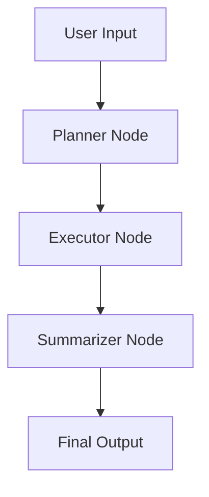

# 🧠 LLM Agent Pipeline with LangGraph & Groq LLaMA3

A lightweight, modular **LLM agent framework** built using [LangGraph](https://docs.langgraph.dev), powered by **Groq's ultra-fast LLaMA3-8B** model. This project demonstrates how to create a goal-oriented agent that breaks down a user prompt into sub-tasks, executes each one using LLM reasoning, and summarizes the outcome — all within a structured graph-based flow.

---

## 🚀 Features

* 🧩 **Modular Graph Architecture** using `LangGraph`
* ⚡ **Super-fast LLM responses** with Groq’s `llama3-8b-8192`
* 📝 **Dynamic Planning → Execution → Summary**
* 🧪 Clean output at each step for inspection or reuse
* 🛠️ Easily extensible: add tools, memory, or new nodes

---

## 🔄 Flow Overview



---

## 📦 Tech Stack

| Tool          | Purpose                                 |
| ------------- | --------------------------------------- |
| **LangGraph** | State-based flow control for LLM agents |
| **LangChain** | LLM interface abstraction               |
| **Groq API**  | High-speed inference with LLaMA3        |
| **Python**    | Core logic and execution                |
| **dotenv**    | Secure API key handling                 |

---

## 🛠️ Setup

1. **Clone the repo**

```bash
git clone https://github.com/your-username/langgraph-agent-pipeline.git
cd langgraph-agent-pipeline
```

2. **Install dependencies**

```bash
pip install -r requirements.txt
```

3. **Set your API key**

Create a `.env` file:

```env
GROQ_API_KEY=your_groq_api_key_here
```

4. **Run the app**

```bash
python main.py
```

---

## 📌 Example Use

**Input:**

> "Plan and write a blog post on benefits of AI in education"

**Planner Output:**

* Research recent uses of AI in education
* Draft key benefits with examples
* Conclude with future outlook

**Final Output:**
A concise blog-ready explanation connecting all the above points.

---

## 🤔 Why LangGraph?

LangGraph makes it easy to build **stateful, multi-step agents** that mimic how humans reason through tasks. This project helps you get started with a real use case and a simple but powerful LLM-powered pipeline.

---

## 🧩 Ideas for Extensions

* Integrate web search or tools (e.g., SerpAPI)
* Add memory for long-term tracking
* Convert into a CLI app or Streamlit dashboard

---

## 📄 License

MIT License

---

